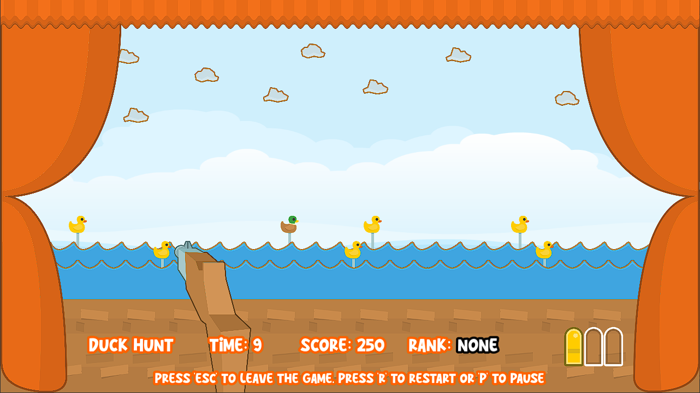
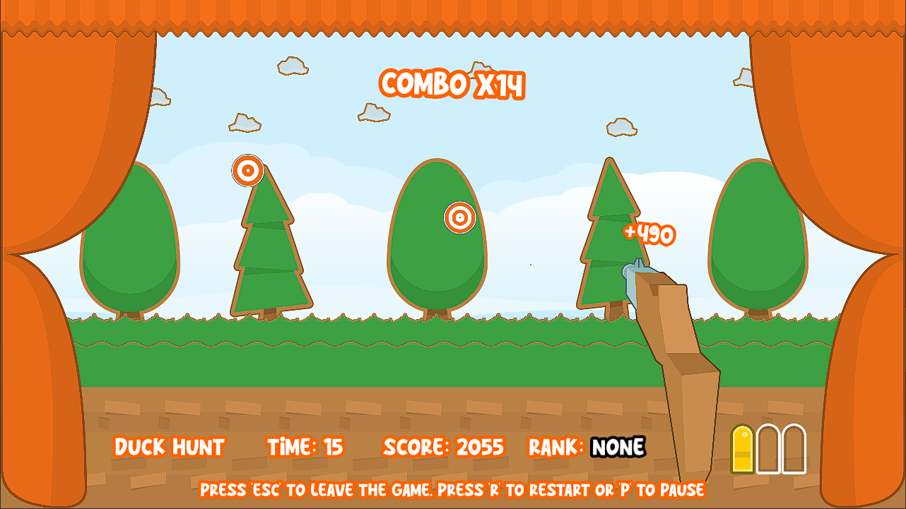

# Shooting Gallery
A remake of the old Shooting Range game made in Godot.

Play the game here: https://sp4r0w.itch.io/shooting-gallery

### About
-------------
This is a small project I made in Godot 4. It's a remake of the old Shooting range games I made way back in Python and Lua. This is the final version.  
I tried to add much more detail and animations to this project and I'm quite happy with it.  
The game uses a "script" system for each level, which means it's really easy to add new waves and script them.  

### Getting Started
-------------
To compile this project, you will need at least Godot v4.0.3. Do not forget you will need the required export templates.   
More in-depth guide is avaiable here: https://docs.godotengine.org/en/stable/tutorials/export/exporting_projects.html  
You're free to modify the project as you wish.

### Credits
-------------
I will only list some credits here, as the full list is in the game itself, in the Credits menu.  
Thanks to DipShtick (Varga) testing.  
Graphical assets were made by Kenney (https://kenney.nl/)  

### Preview
-------------

Play the game here: https://sp4r0w.itch.io/shooting-gallery
